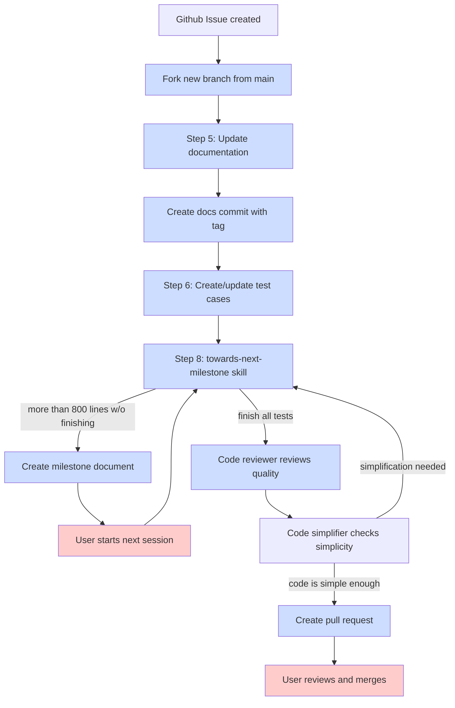

# Issue to Implementation Workflow

Complete development cycle from GitHub issue to pull request.



## Documentation Commit Convention

The workflow creates a dedicated `[docs]` commit during Step 5, separate from test and implementation commits:

1. **Documentation files updated** - apply changes from "Documentation Planning" section
2. **Diff specifications followed** - if plan includes `--diff` previews, apply them directly
3. **Separate commit created** - `[docs]` tag enables easy tracking and revert if needed

This separation provides:
- Clear audit trail for documentation changes
- Ability to revert documentation independently from code
- Explicit tracking of documentation completeness

## Plan Caching

During Step 4 (Read Implementation Plan), the workflow extracts the "Proposed Solution" section from the GitHub issue and caches it locally:

**Cache location:** `${AGENTIZE_HOME:-.}/.tmp/plan-of-issue-{N}.md`

This cached plan enables:
- Drift awareness during handsoff continuation prompts
- Easier resumption when sessions are interrupted
- Context preservation across multiple continuation cycles

The stop hook reads this cached plan (when available) and includes it in the `/issue-to-impl` continuation prompt. If the plan cache is missing, the continuation prompt gracefully degrades without the plan context.

## Dry-Run Mode

Use `--dry-run` to preview the implementation workflow without making changes:

```
/issue-to-impl 42 --dry-run
```

**Behavior:**
- Reads the issue plan and validates it has a "Proposed Solution" section
- Prints a preview of intended actions:
  - Branch that would be created
  - Files that would be modified/created
  - Estimated LOC per step
  - Test strategy summary
- **Does NOT**: Create branch, modify files, create commits, write milestone files, or create PR

**Use case:** Verify the issue has a complete plan before starting implementation.

