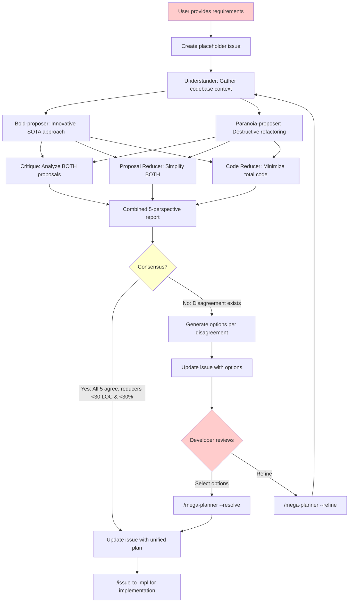

# Mega Planner Workflow

Multi-agent debate-based planning with dual proposers (bold + paranoia) and partial consensus for complex features requiring developer arbitration.

## Overview

The mega-planner workflow extends ultra-planner with a 5-agent dual-proposer architecture that:
1. Forces exposure of inter-agent disagreements to developers
2. Provides multiple technical route options
3. Introduces proposer-vs-proposer tension (constructive vs destructive changes)
4. Introduces reducer-vs-reducer tension (minimize change scope vs minimize code footprint)

## Workflow Diagram



## Core Design Principles

### Mandatory Disagreement Exposure

Unlike ultra-planner which auto-resolves disagreements, mega-planner forces all contested design decisions to surface as Disagreement sections requiring developer selection.

### Consensus Criteria

**CONSENSUS** is reached when ALL conditions are true:
1. Bold and Paranoia propose the same general approach
2. Critique finds no critical blockers
3. Both Reducers recommend implementing BOTH proposals, and for each proposal their recommended changes are <30 lines AND <30% of total LOC

**DISAGREEMENT** = NOT CONSENSUS. Any condition failure triggers disagreement.

### Dual-Proposer Tension

| Agent | Approach | Trade-off |
|-------|----------|-----------|
| **Bold Proposer** | Innovative, additive, builds on existing code | Higher feature velocity, may increase complexity |
| **Paranoia Proposer** | Destructive refactoring, tears down and rebuilds | Reduces tech debt, may break backwards compatibility |

### Dual-Reducer Tension

| Agent | Focus | Trade-off |
|-------|-------|-----------|
| **Proposal Reducer** | Minimize change scope | Smaller PRs, incremental delivery |
| **Code Reducer** | Minimize total code footprint | Allows large changes if net code decreases |

## Usage

### Create Plan

```
/mega-planner <feature_description>
```

Same as ultra-planner, but uses 5-agent debate and exposes disagreements.

### Resolve Disagreements

```
/mega-planner --resolve <issue_no> <your_selections>
```

Fast-path resolution without re-running the 5-agent debate.

**Selection format:**
- Option codes: `1B` (Disagreement 1, Option B)
- Multiple selections: `1B,2A` or `1C 2B`

### Refine Plan

```
/mega-planner --refine <issue_no> [instructions]
```

Re-runs 5-agent debate with refinement focus.

### From Issue

```
/mega-planner --from-issue <issue_no>
```

Plans an existing feature request issue.

## Commands Summary

| Command | Description |
|---------|-------------|
| `/mega-planner <desc>` | Create plan with 5-agent debate |
| `/mega-planner --resolve <N> <opts>` | Resolve disagreements without re-debate |
| `/mega-planner --refine <N> [comments]` | Re-run debate to improve plan |
| `/mega-planner --from-issue <N>` | Plan from existing issue |

## Comparison to Ultra-Planner

| Aspect | Ultra-Planner | Mega-Planner |
|--------|---------------|--------------|
| **Agents** | 3 (Bold, Critique, Reducer) | 5 (Bold, Paranoia, Critique, 2 Reducers) |
| **Proposers** | 1 (Bold only) | 2 (Bold + Paranoia) |
| **Reducers** | 1 (Proposal Reducer) | 2 (Proposal + Code Reducer) |
| **Disagreement handling** | Auto-resolved | Exposed to developer |
| **Consensus criteria** | Implicit | Explicit (30 LOC AND 30% threshold) |
| **Resolve mode** | Not available | `--resolve` fast-path |
