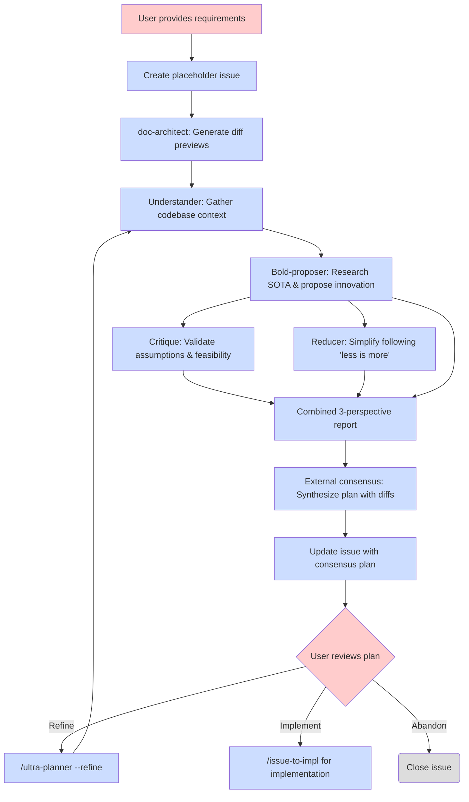
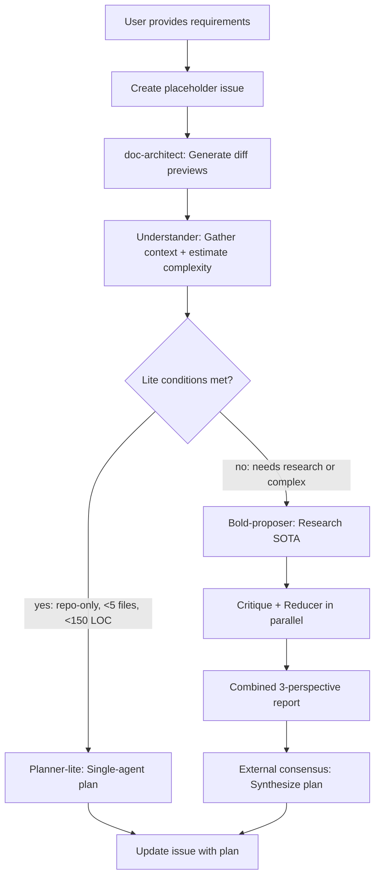

# Ultra Planner Workflow

Multi-agent debate-based planning workflow for complex features with issue-based refinement.

## Overview

The ultra-planner workflow creates implementation plans through multi-agent debate and automatically publishes them as GitHub issues. This enables early visibility and issue-based refinement.

## Workflow Diagram



## Key Features

### 1. Automatic Complexity-Based Routing

Ultra-planner automatically routes between lightweight and full debate workflows based on estimated modification complexity. After the understander gathers codebase context, it estimates the modification's LOC and recommends a path:

- **Lite path**: Single-agent planner when ALL conditions met:
  - All knowledge within repo (no internet research needed)
  - < 5 files affected
  - < 150 LOC total
- **Full path**: Multi-agent debate with web research (otherwise)

**Workflow with routing:**



**Benefits:**
- 55-70% cost reduction for simple tasks
- 4-8 minute time savings (1-2 min lite vs 6-12 min full)
- No user intervention required

**Override flag:**
```
/ultra-planner --force-full <feature-description>
```
Forces full multi-agent debate regardless of complexity estimation.

### 2. Automatic Issue Creation

Ultra-planner creates a GitHub issue **before** running the multi-agent debate workflow:

- **Placeholder created first** - issue established immediately after feature validation
- **Issue-numbered artifacts** - all planning files use `issue-{N}-` prefix from the start
- **Plan prefix** - title gets `[plan][tag]` format
- **Updated after consensus** - same issue is updated with final plan (no second issue created)
- **Early collaboration** - stakeholders can see issue number and planning progress immediately

**Example:**
```
Created placeholder issue: #42
Title: [plan][feat] Add user authentication
URL: https://github.com/user/repo/issues/42

Running multi-agent debate...
[Bold proposer, Critique, Reducer agents execute]

Issue #42 updated with consensus plan.

To refine: /ultra-planner --refine 42
To implement: /issue-to-impl 42
```

### 2a. Issue-Based Refinement

Refinement mode (`/ultra-planner --refine`) enables iterative plan improvement:

- **Fetches issue body** - pulls current plan from GitHub
- **Runs full debate** - same three-agent workflow as initial planning
- **Accepts refinement focus** - optional inline instructions guide the agents
- **Updates issue atomically** - replaces body only after consensus completes

**Example (General refinement):**
```
/ultra-planner --refine 42

Fetching issue #42...
Running debate on current plan...

[Agents analyze and improve plan - 5-10 minutes]

Issue #42 updated with refined plan.
Summary: Reduced LOC 280→250, improved security
```

**Example (Directed refinement):**
```
/ultra-planner --refine 42 Focus on reducing complexity

Fetching issue #42...
Refinement focus: Focus on reducing complexity
Running debate on current plan...

[Agents focus on simplification - 5-10 minutes]

Issue #42 updated with refined plan.
Summary: Reduced LOC 280→150, removed OAuth2, simplified middleware
```

### 2b. Label-Triggered Auto Refinement

The server can automatically trigger refinement when the `agentize:refine` label is added to a plan issue. This enables refinement requests without manual `/ultra-planner --refine` invocation.

**To trigger auto refinement:**
1. Ensure the issue has Status = `Proposed`
2. Add the `agentize:refine` label (via GitHub UI or `gh issue edit --add-label agentize:refine`)
3. The server's next poll cycle will:
   - Detect the refinement candidate
   - Set Status to `Refining` (concurrency control)
   - Run `/ultra-planner --refine` headlessly
   - On completion: reset Status to `Proposed` and remove the label

**Requirements:**
- Issue must have both `agentize:plan` and `agentize:refine` labels
- Status must be `Proposed` (not `Plan Accepted` or `In Progress`)
- Server must be running (`lol serve`)

### 3. Documentation Planning with Diff Previews

The external consensus process must explicitly identify documentation impacts and produce a **Documentation Planning** section in the final plan. This ensures all documentation changes are identified early and tracked through implementation.

**Standard format:**
```markdown
## Documentation Planning

### High-level design docs (docs/)
- `docs/workflows/feature-name.md` — create new workflow documentation
- `docs/tutorial/XX-feature-name.md` — update tutorial with new feature

### Folder READMEs
- `src/feature/README.md` — update purpose and organization for new module

### Interface docs
- `src/api/endpoints.md` — update API interface documentation
```

**Enhanced format with diff previews:**

When using `/doc-architect --diff`, the Documentation Planning section includes markdown diff previews showing proposed changes:

```markdown
## Documentation Planning

### High-level design docs (docs/)
- [ ] `docs/workflows/feature-name.md` — update workflow diagram

` ` `diff
  ## Workflow Diagram

  ` ` `mermaid
  graph TD
      A[Start] --> B[Process]
+     B --> C[New Step]
+     C --> D[End]
-     B --> D[End]
  ` ` `
` ` `

### Folder READMEs
- [ ] `src/feature/README.md` — update purpose

` ` `diff
  # Feature Module
- Handles basic functionality.
+ Handles basic functionality with enhanced diff preview support.
` ` `
```

**Benefits of diff previews:**
- Task list checkboxes enable progress tracking in GitHub UI
- Diff blocks show exact proposed changes before implementation
- Reduces ambiguity in documentation requirements
- `/issue-to-impl` Step 5 can apply diff specifications directly

The consensus plan references command interfaces by citing actual `docs/` files (e.g., `docs/workflows/ultra-planner.md`, `docs/tutorial/02-issue-to-impl.md`) to ensure accuracy and grounding.

**Skill integration:**
The `/doc-architect` skill generates this checklist format. Use `/doc-architect --diff` for diff previews.

### 4. Review and Implementation

After reviewing a plan issue:

- **Review on GitHub** - examine the plan details in the issue body
- **Refine if needed** - use `/ultra-planner --refine` for improvements
- **Implement when ready** - use `/issue-to-impl` to start implementation
- **Flexible timing** - implement when ready, no time pressure

## Runtime Expectations

### Ultra-Planner Initial Run

**With automatic routing**, timing depends on the estimated complexity:

#### Lite Path (repo-only, <5 files, <150 LOC)

**Duration:** 1-2 minutes end-to-end

**Breakdown:**
- Understander agent: 1-2 minutes (codebase exploration + complexity estimation)
- Planner-lite agent: 30-60 seconds (single-agent planning)
- No consensus step (single agent, nothing to synthesize)
- Draft issue creation: <10 seconds

**Cost:** ~$0.30-0.80 per planning session (2 Sonnet agents, no external review)

#### Full Path (≥ 200 LOC)

**Duration:** 6-12 minutes end-to-end

**Breakdown:**
- Understander agent: 1-2 minutes (codebase exploration + complexity estimation)
- Bold-proposer agent: 2-3 minutes (research + proposal, with context)
- Critique + Reducer agents (parallel): 2-3 minutes
- External consensus review: 1-2 minutes
- Draft issue creation: <10 seconds

**Cost:** ~$2.50-6 per planning session (1 Sonnet + 3 Opus agents + 1 external review)

### Refinement Run (--refine mode)

**Duration:** 6-12 minutes end-to-end (same as initial run)

**Breakdown:**
- Same agent execution times as ultra-planner (includes understander)
- Issue fetch/update: <5 seconds

**Cost:** ~$2.50-6 per refinement (same as initial planning)

## Lifecycle States

1. **Plan Issue** - `[plan][tag]: Title`
   - Created automatically by ultra-planner
   - Visible to all stakeholders
   - Can be refined via `/ultra-planner --refine`
   - Can be implemented via `/issue-to-impl`

2. **Closed/Abandoned** - Issue closed on GitHub
   - Plan completed (close reason: `completed`) or not pursued (close reason: `not planned`)
   - Closed issues can be reopened later if needed
   - Use GitHub's close reason to distinguish between completed work vs abandoned ideas

## Commands Summary

### `/ultra-planner <feature-description>`

Creates initial plan via automatic routing (lite or full path) and auto-creates plan issue.

**Usage:**
```
/ultra-planner Add user authentication with JWT and RBAC
```

**Routing:** Understander checks lite conditions:
- Lite path (repo-only, <5 files, <150 LOC): Single-agent planning (1-2 min)
- Full path (otherwise): Multi-agent debate with web research (6-12 min)

**Output:** Plan issue URL and refinement/implementation instructions

### `/ultra-planner --dry-run <feature-description>`

Runs the full planning workflow but skips GitHub issue creation/updates.

**Usage:**
```
/ultra-planner --dry-run Add user authentication with JWT tokens
```

**Behavior:**
- Runs understander, bold-proposer, critique, and reducer agents
- Generates consensus plan to `.tmp/` files
- Prints dry-run summary showing what issue would be created
- **Does NOT**: Create placeholder issue, update issue body, or add labels

**Output:** Dry-run summary with planned issue title, tags, and LOC estimate

**Note:** Token costs remain similar to regular runs since the multi-agent debate still executes. Use this when you want to review the plan before committing to GitHub.

### `/ultra-planner --force-full <feature-description>`

Forces full multi-agent debate regardless of complexity estimation.

**Usage:**
```
/ultra-planner --force-full Add simple helper function
```

**Use case:** When you want thorough multi-perspective analysis even for simple changes.

**Output:** Plan issue URL and refinement/implementation instructions

### `/ultra-planner --refine <issue-number> [refinement-instructions]`

Refines existing plan issue via multi-agent debate and updates issue body.

**Usage:**
```
/ultra-planner --refine 42
/ultra-planner --refine 42 Focus on reducing complexity
/ultra-planner --refine 42 Add more error handling and edge cases
```

**Output:** Updated issue URL and summary of changes

### `/ultra-planner --from-issue <issue-number>`

Creates a plan for an existing issue (typically a feature request) without creating a new placeholder issue.

**Usage:**
```
/ultra-planner --from-issue 42
```

**Behavior:**
1. Reads issue #42's title and body as the feature description
2. Runs the full multi-agent debate workflow (same as initial planning)
3. Updates issue #42 with the consensus plan (adds `[plan]` prefix to title)
4. Adds `agentize:plan` label to mark as planned

**Use case:** Server-driven feature request planning. When the server discovers issues with `agentize:dev-req` label, it invokes `/ultra-planner --from-issue <N>` to automatically generate implementation plans.

**Output:** Updated issue URL and plan summary

### `/issue-to-impl <issue-number>`

Implements plan issue.

**Usage:**
```
/issue-to-impl 42
```

**Output:** Implementation progress and milestone commits

## CLI Implementation

The debate pipeline described above is also available as a standalone shell function:

```bash
planner plan "<feature-description>"
```

This does not change the `/ultra-planner` command interface documented above. See `docs/cli/planner.md` for the CLI reference.

## Comparison to Previous Workflow

| Aspect | Previous (v1) | Current (v2) |
|--------|----------|-------------|
| **Issue creation** | After user approval | Automatic placeholder first |
| **Approval step** | CLI prompt before issue | Review after issue creation |
| **Refinement** | No refinement support | `--refine` mode for iteration |
| **Collaboration** | Plan files in `.tmp` | GitHub issues from start |
| **Visibility** | Private until approved | Public issues immediately |
| **Workflow** | Approval → Issue → Impl | Issue → Refine* → Impl |

*Refinement is optional and can be done multiple times using `--refine`

