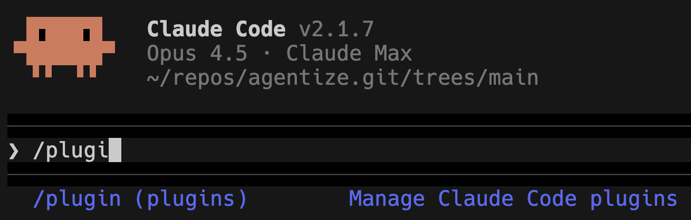
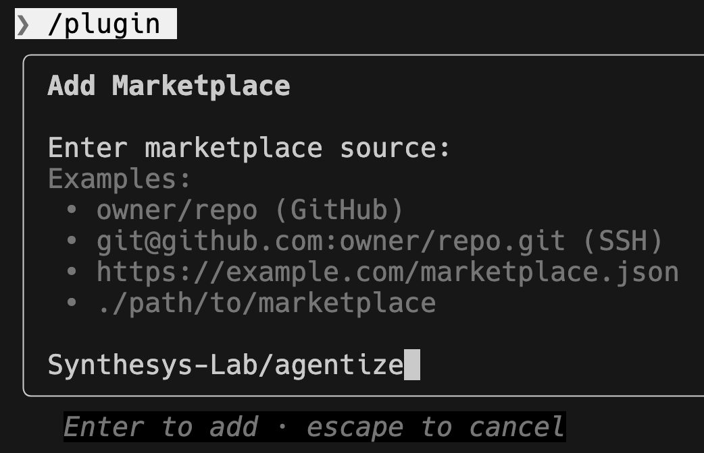
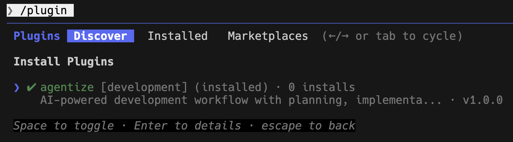

# Tutorial 00: Initialize Your Project

**Read time: 3-5 minutes**

This tutorial shows you how to set up the Agentize framework in your project.
Currently, this framework is stuck to Claude Code CLI.
~I am not sure how long it will take to support other Coding agents.~

## Getting Started

After installing Agentize (see README.md), you can start using its features in your project.

## Installing Agentize

Agentize is currently managed by Claude Code Plugin Marketplace. To install it:

1. Open Claude Code in your project from command line:
```bash
claude
```
2. Open the Plugin Marketplace:


Then,


3. Add `Synthesys-Lab/agentize` (case insensitive) to your marketplace:



4. Install the plugin.




## Verify Installation

After setup, verify Claude Code recognizes your configuration:

```bash
# In your project directory with Claude Code
/ultra-planner # Auto-completion shall pop up
/issue-to-impl
```

You should see your custom commands listed (like `/issue-to-impl`, `/code-review`, etc.).

## Preferred Project Organization

0. `docs/` is the key for the agent to understand your project.
1. Edit `docs/git-msg-tags.md` - the current tags are for the Agentize project itself. You can customize these tags to fulfill your project's module requirements.
For example, you might add project-specific tags like:
```markdown
- `api`: API changes
- `ui`: User interface updates
- `perf`: Performance improvements
```
2. It is preferred to have a `docs/architecture/` folder where you can document your project's architecture. This helps the agent understand your project better.


## Next Steps

Once initialized:
- **Tutorial 01**: Learn how to create implementation plans with `/ultra-planner` (uses the git tags you just customized)
- **Tutorial 02**: Learn the full development workflow with `/issue-to-impl`
- **Tutorial 03**: Scale up with parallel development workflows

## Configuration Options

For detailed configuration options:
- See `README.md` for architecture overview
- See `docs/architecture/` for design documentation
