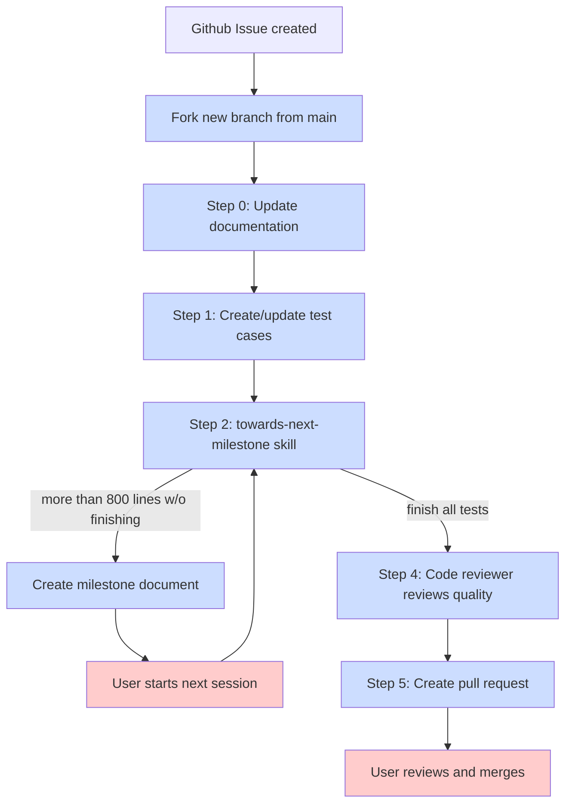

# Issue to Implementation Workflow

Complete development cycle from GitHub issue to pull request.

```mermaid
graph TD
    A[Github Issue created] --> B[Fork new branch from main]
    B --> C[Step 0: Update documentation]
    C --> D[Step 1: Create/update test cases]
    D --> E[Step 2: towards-next-milestone skill]
    E -->|more than 800 lines w/o finishing| F[Create milestone document]
    F --> G[User starts next session]
    G --> E
    E -->|finish all tests| H[Step 4: Code reviewer reviews quality]
    H --> I[Step 5: Create pull request]
    I --> J[User reviews and merges]

    style G fill:#ffcccc
    style J fill:#ffcccc
    style B fill:#ccddff
    style C fill:#ccddff
    style D fill:#ccddff
    style E fill:#ccddff
    style F fill:#ccddff
    style H fill:#ccddff
    style I fill:#ccddff
```

