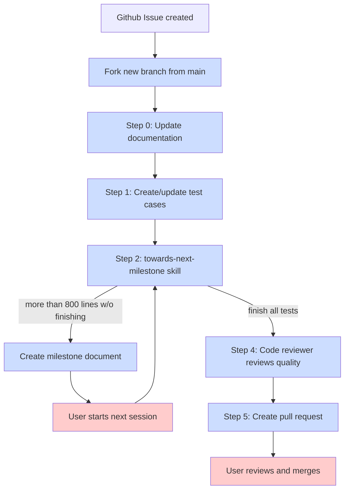

# Issue to Implementation Workflow

Complete development cycle from GitHub issue to pull request.



## Hands-Off Mode

Enable automated execution without manual permission prompts by setting `CLAUDE_HANDSOFF=true`. This auto-approves safe local operations (file edits, test runs, local commits) while maintaining safety boundaries for destructive or publish actions.

With hands-off mode enabled, the implementation workflow automatically continues through milestones up to the configured limit (default: 10 continuations per session). Once the limit is reached, manual resume is required:

```bash
User: Continue from the latest milestone
User: Resume implementation
```

See [Hands-Off Mode Documentation](../handsoff.md) for complete details on auto-continue limits and configuration.
