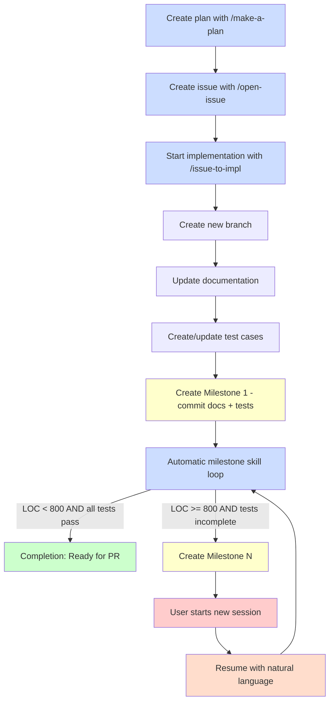

# Milestone Workflow

This document describes the milestone workflow for implementing large features incrementally with automatic progress tracking and checkpoint creation.

## Overview

The milestone workflow enables AI agents to implement large features (typically > 800 LOC) in manageable increments, creating checkpoint documents that track progress, test status, and remaining work. This allows development to span multiple sessions while maintaining clear context.

### What are Milestones?

Milestones are development checkpoints created during the implementation of large features. Each milestone:

- **Tracks progress**: Records what has been implemented and what remains
- **Monitors tests**: Shows which tests are passing and which are not
- **Provides context**: Enables resuming work from where you left off
- **Commits progress**: Creates git commits with `--no-verify` to bypass pre-commit hooks when tests are incomplete

### When to Use Milestones

Use the milestone workflow when:

- **Large features**: Implementation estimated at > 800 LOC
- **Multi-session work**: Feature requires breaking work across multiple sessions
- **Complex implementations**: Step-by-step incremental progress is beneficial
- **Test-driven development**: Tests exist but implementation is in progress

**Do NOT use milestones for:**
- Small features (< 200 LOC) - implement directly
- Bug fixes - use regular commits
- Documentation-only changes - no need for incremental tracking

---

## Workflow Diagram



**Legend:**
- **Blue boxes**: Automated steps performed by AI agents/skills/commands
- **Yellow boxes**: Milestone creation points
- **Green boxes**: Completion/success states
- **Red boxes**: User intervention required (start new session)

---

## Milestone Document Format

Milestone documents are stored in `.milestones/issue-{N}-milestone-{M}.md` where:
- `{N}` is the issue number
- `{M}` is the milestone number (1, 2, 3, ...)

### Document Structure

```markdown
# Milestone {M} for Issue #{N}

**Branch:** issue-{N}
**Created:** YYYY-MM-DD HH:MM:SS
**LOC Implemented:** ~XXX lines
**Test Status:** X/Y tests passed

## Work Remaining

[List of implementation steps not yet completed from the original plan]

- Step 3: Implement feature X (Estimated: 120 LOC)
  - File: path/to/file.py - Description
- Step 4: Add edge case handling (Estimated: 80 LOC)
  - File: path/to/other.py - Description

## Next File Changes (Estimated LOC for Next Milestone)

- `path/to/file1.py`: Description of changes needed (~50 LOC)
- `path/to/file2.py`: Description of changes needed (~120 LOC)
- `tests/test_feature.sh`: Additional test cases (~80 LOC)

**Total estimated for next milestone:** ~250 LOC

## Test Status

**Passed Tests:**
- test-agentize-modes.sh: All 6 tests passed
- test-c-sdk.sh: All tests passed

**Not Passed Tests:**
- test-new-feature.sh: 3 tests failing
  - Test case: Feature initialization
  - Test case: Edge case handling
  - Test case: Error recovery
```

---

## Commands and Skills

### `/issue-to-impl` - Start Implementation

Orchestrates the full implementation workflow from issue to completion.

**Usage:**
```
/issue-to-impl [issue-number]
```

If issue number is not provided, it will be extracted from conversation context.

**What it does:**
1. Creates a new development branch using the `fork-dev-branch` skill
2. Updates documentation based on the plan in the issue
3. Creates/updates test cases based on the plan
4. Creates **Milestone 1** automatically (commits docs + tests)
5. Starts the automatic milestone skill loop:
   - Implements code in chunks (~100-200 LOC)
   - Runs tests after each chunk
   - Stops when LOC ≥ 800 without completion (creates next milestone)
   - Continues until all tests pass (completion)

**Stopping conditions:**
- **Milestone created**: Agent stops and informs user to resume in next session
- **Completion**: All tests pass, ready for PR creation

**Example:**
```
User: /issue-to-impl 42
Agent: Creating branch issue-42...
Agent: Updating documentation...
Agent: Creating test cases...
Agent: Creating Milestone 1 (0/8 tests pass)...
Agent: Implementing feature...
Agent: Milestone 2 created at 850 LOC (3/8 tests pass).
Agent: Resume with: "Continue from the latest milestone"
```

### Resuming from Milestones

When a milestone is created, use natural language to resume implementation.

**Usage:**
```
User: Resume from the latest milestone
User: Continue implementation
User: Continue from .milestones/issue-42-milestone-2.md
```


**What happens:**
1. Validates you're on a development branch (issue-{N}-*)
2. Finds the latest milestone file: `.milestones/issue-{N}-milestone-*.md`
3. Loads context: work remaining, next file changes, test status
4. Displays milestone summary
5. Invokes the milestone skill to continue implementation
6. Creates next milestone or completes if all tests pass

**Example:**
```
User: Continue from the latest milestone
Agent: Resuming from Milestone 2 for Issue #42
Agent: Test status: 3/8 tests passed
Agent: Estimated work remaining: ~350 LOC
Agent: Continuing implementation...
Agent: [implements next chunk]
Agent: Milestone 3 created at 780 LOC (6/8 tests pass).
Agent: Resume with: "Continue from the latest milestone"
```

### `milestone` Skill - Implementation Driver

The core skill that drives incremental implementation. Automatically invoked by `/issue-to-impl` and natural-language resume requests.

**What it does:**
- Reads the plan from issue or latest milestone document
- Implements code in chunks (100-200 LOC per chunk)
- Tracks total LOC count using `git diff --stat`
- Runs tests after each implementation chunk
- Parses test results to track passed/failed counts
- Creates milestone documents when LOC ≥ 800 without completion
- Signals completion when all tests pass

---

## Example Walkthrough

### Scenario: Implementing a Large Feature (1200 LOC estimated)

**Step 1: Planning**
```
User: /make-a-plan
[Agent creates comprehensive plan with 1200 LOC estimate]

User: /open-issue
[Agent creates issue #42 with the plan]
```

**Step 2: Start Implementation**
```
User: /issue-to-impl 42

Agent: Creating branch issue-42...
Agent: Updating documentation...
  - docs/typescript-support.md created
  - README.md updated
Agent: Creating test cases...
  - tests/test-typescript.sh created (8 test cases)
Agent: Creating Milestone 1...
  - Committed docs + tests (0/8 tests pass)
Agent: Implementing feature...
  [works for ~45 minutes, implementing code]
Agent: Milestone 2 created at 820 LOC (3/8 tests pass)
Agent: Resume with: "Continue from the latest milestone"
```

**Step 3: Resume (Next Session)**
```
User: Continue from the latest milestone

Agent: Resuming from Milestone 2 for Issue #42
Agent: Test status: 3/8 tests passed
Agent: Estimated work remaining: ~380 LOC
Agent: Continuing implementation...
  [works for ~30 minutes]
Agent: All tests passed (8/8)!
Agent: Implementation complete, ready for PR creation.
```

---

## Best Practices

### 1. Always Start with a Plan

Create a detailed plan using `/make-a-plan` before starting implementation. The plan should include:
- Specific files to modify/create
- LOC estimates for each step
- Test strategy
- Implementation steps in Design-first TDD order

### 2. Run `/issue-to-impl` Instead of Manual Branch Creation

Don't manually create branches and implement - use `/issue-to-impl` which:
- Creates the branch correctly
- Sets up docs and tests first
- Creates the first milestone automatically
- Starts implementation in the right order

### 3. Resume After Each Milestone

When a milestone is created, the agent stops. To continue, use natural language:
```
User: Resume from the latest milestone
User: Continue implementation
```

This loads the context and continues from where you left off.

### 4. Milestone Commits Use `--no-verify`

Milestone commits bypass pre-commit hooks because tests are expected to be incomplete. However:
- Tests are ALWAYS run to track progress
- Milestone commits include test status (e.g., "3/8 tests pass")
- Only delivery commits (all tests pass) are merged to main
- Never use milestone commits on the main branch

### 5. Monitor Test Progress

Each milestone shows test status:
```
**Test Status:** 3/8 tests passed

**Passed Tests:**
- Test 1: Basic initialization
- Test 2: Config loading
- Test 3: Error handling

**Not Passed Tests:**
- Test 4: Edge case handling
- Test 5: Performance requirements
- Test 6: Integration with existing code
- Test 7: Cleanup logic
- Test 8: Error recovery
```

This helps you track progress toward completion.

### 6. Completion = All Tests Pass

Implementation is complete when all tests pass. At this point:
- No milestone is created
- Agent signals completion
- **Final commit must be a delivery commit** (without `[milestone]` tag):
  - Use `purpose=delivery` in commit-msg skill
  - No `--no-verify` flag (pre-commit hooks run normally)
  - Only delivery commits should be merged to main
- Ready for code review and PR creation

### 7. Review and PR Workflow

After implementation completes with all tests passing, follow this workflow:

**Option A: Manual workflow (recommended for control)**
```
1. /code-review          # Review changes, get feedback
2. [Fix any issues found]
3. /open-pr              # Create pull request
```

**Option B: Convenience wrapper (recommended after implementation completion)**
```
/pull-request --open     # Review + create PR in one step
```

The `/pull-request` command provides a streamlined workflow:
- **Without flags**: Runs code review and stops with next-step guidance
- **With --open flag**: Runs code review, then creates PR immediately if review passes

---

## Troubleshooting

### "No milestone files found"

You're trying to resume from a milestone on a branch without milestones.

**Solution**: Use `/issue-to-impl` to start implementation, which creates the first milestone.

### "Not on development branch"

You're on `main` or another non-development branch.

**Solution**: Switch to your development branch (issue-{N}) or start with `/issue-to-impl`.

### "Milestone file corrupted"

The milestone document is not properly formatted.

**Solution**: Check the file in `.milestones/` and fix the format, or delete it and restart with `/issue-to-impl`.

### Tests are Not Running

Ensure your project has a `make test` target or specify test commands in your plan.

**Solution**: Add test execution to your Makefile or update the plan to specify how tests should be run.

---

## Technical Details

### LOC Tracking Mechanism

The milestone skill tracks LOC using `git diff --stat`:
- Accumulates total LOC count across the session
- Checks against 800 LOC threshold after each implementation chunk
- Stops when LOC ≥ 800 without all tests passing
- Creates milestone document with current status

### Test Status Parsing

After running tests, the milestone skill parses output to extract:
- Total test count
- Passed test count
- Failed test count
- Individual test case names and status

This information is included in milestone documents and commit messages.

### Milestone Document Versioning

Milestone documents are immutable once created:
- `issue-42-milestone-1.md` - First milestone
- `issue-42-milestone-2.md` - Second milestone
- `issue-42-milestone-3.md` - Third milestone
- etc.

Each file represents a snapshot in time. Git history shows the evolution of the implementation.
