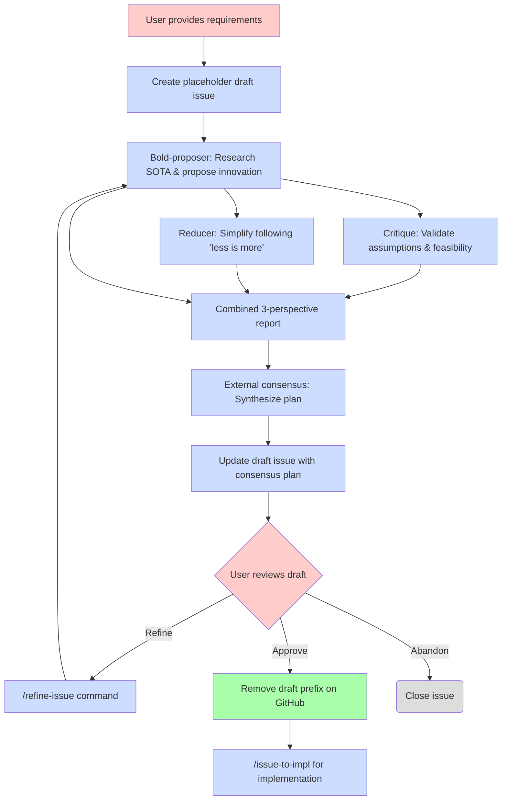

# Ultra Planner Workflow

Multi-agent debate-based planning workflow for complex features with progressive draft-based refinement.

## Overview

The ultra-planner workflow creates implementation plans through multi-agent debate and automatically publishes them as draft GitHub issues. This enables early visibility and issue-based refinement without blocking on approval.

## Workflow Diagram



## Key Features

### 1. Automatic Draft Creation

Ultra-planner creates a draft GitHub issue **before** running the multi-agent debate workflow:

- **Placeholder created first** - draft issue established immediately after feature validation
- **Issue-numbered artifacts** - all planning files use `issue-{N}-` prefix from the start
- **Draft prefix** - title gets `[draft][plan][tag]` format
- **Updated after consensus** - same issue is updated with final plan (no second issue created)
- **Early collaboration** - stakeholders can see issue number and planning progress immediately

**Example:**
```
Created placeholder draft issue: #42
Title: [draft][plan][feat] Add user authentication
URL: https://github.com/user/repo/issues/42

Running multi-agent debate...
[Bold proposer, Critique, Reducer agents execute]

Issue #42 updated with consensus plan.

To refine: /refine-issue 42
To implement: Remove [draft] on GitHub, then /issue-to-impl 42
```

### 2. Issue-Based Refinement

The `/refine-issue` command enables iterative plan improvement:

- **Fetches issue body** - pulls current plan from GitHub
- **Runs full debate** - same three-agent workflow as ultra-planner
- **Accepts refinement focus** - optional inline instructions guide the agents
- **Updates issue atomically** - replaces body only after consensus completes
- **Preserves draft status** - keeps `[draft]` prefix until manually removed

**Example (General refinement):**
```
/refine-issue 42

Fetching issue #42...
Running debate on current plan...

[Agents analyze and improve plan - 5-10 minutes]

Issue #42 updated with refined plan.
Summary: Reduced LOC 280→250, improved security
```

**Example (Directed refinement):**
```
/refine-issue 42 Focus on reducing complexity

Fetching issue #42...
Refinement focus: Focus on reducing complexity
Running debate on current plan...

[Agents focus on simplification - 5-10 minutes]

Issue #42 updated with refined plan.
Summary: Reduced LOC 280→150, removed OAuth2, simplified middleware
```

### 3. Manual Approval

Users approve plans by removing the `[draft]` prefix on GitHub:

- **Simple UI action** - edit issue title, remove `[draft]`
- **No CLI required** - approval happens in GitHub web UI
- **Clear signal** - non-draft issues are ready for implementation
- **Flexible timing** - approve when ready, no time pressure

## Runtime Expectations

### Ultra-Planner Initial Run

**Duration:** 5-10 minutes end-to-end

**Breakdown:**
- Bold-proposer agent: 2-3 minutes (research + proposal)
- Critique + Reducer agents (parallel): 2-3 minutes
- External consensus review: 1-2 minutes
- Draft issue creation: <10 seconds

**Cost:** ~$2-5 per planning session (3 Opus agents + 1 external review)

### Refine-Issue Run

**Duration:** 5-10 minutes end-to-end (same as initial run)

**Breakdown:**
- Same agent execution times as ultra-planner
- Issue fetch/update: <5 seconds

**Cost:** ~$2-5 per refinement (same as initial planning)

## Lifecycle States

1. **Draft Plan** - `[draft][plan][tag]: Title`
   - Created automatically by ultra-planner
   - Visible to all stakeholders
   - Can be refined via `/refine-issue`

2. **Approved Plan** - `[plan][tag]: Title`
   - Draft prefix removed manually on GitHub
   - Ready for implementation
   - Can be implemented via `/issue-to-impl`

3. **Closed/Abandoned** - Issue closed on GitHub
   - Plan not pursued
   - Can be reopened later if needed

## Commands Summary

### `/ultra-planner <feature-description>`

Creates initial plan via multi-agent debate and auto-creates draft issue.

**Usage:**
```
/ultra-planner Add user authentication with JWT and RBAC
```

**Output:** Draft issue URL and refinement/approval instructions

### `/refine-issue <issue-number> [refinement-instructions]`

Refines existing plan issue via multi-agent debate and updates issue body.

**Usage:**
```
/refine-issue 42
/refine-issue 42 Focus on reducing complexity
/refine-issue 42 Add more error handling and edge cases
```

**Output:** Updated issue URL and summary of changes

### `/issue-to-impl <issue-number>`

Implements approved plan (after removing `[draft]` prefix).

**Usage:**
```
/issue-to-impl 42
```

**Output:** Implementation progress and milestone commits

## Comparison to Previous Workflow

| Aspect | Previous | Progressive Draft-Based |
|--------|----------|------------------------|
| **Issue creation** | After user approval | Automatic after consensus |
| **Approval step** | CLI prompt | Manual draft removal on GitHub |
| **Refinement** | CLI flag `--refine` | Issue-based `/refine-issue` |
| **Collaboration** | Plan files in `.tmp` | GitHub issues from start |
| **Visibility** | Private until approved | Public drafts immediately |
| **Workflow** | Approval → Issue → Impl | Draft → Refine* → Approve → Impl |

*Refinement is optional and can be done multiple times

## Hands-Off Mode

Enable automated planning workflows without manual permission prompts:

```bash
export CLAUDE_HANDSOFF=true
/ultra-planner "implement user authentication"
/refine-issue 42
```

This auto-approves file reads, exploration, and local file writes during the planning process.

See [Hands-Off Mode Documentation](../handsoff.md) for complete details.
