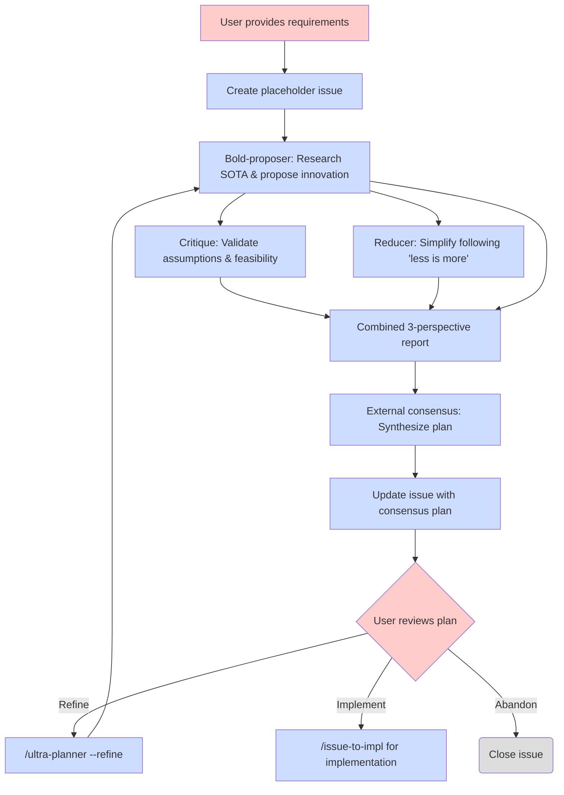

# Ultra Planner Workflow

Multi-agent debate-based planning workflow for complex features with issue-based refinement.

## Overview

The ultra-planner workflow creates implementation plans through multi-agent debate and automatically publishes them as GitHub issues. This enables early visibility and issue-based refinement.

## Workflow Diagram



## Key Features

### 1. Automatic Issue Creation

Ultra-planner creates a GitHub issue **before** running the multi-agent debate workflow:

- **Placeholder created first** - issue established immediately after feature validation
- **Issue-numbered artifacts** - all planning files use `issue-{N}-` prefix from the start
- **Plan prefix** - title gets `[plan][tag]` format
- **Updated after consensus** - same issue is updated with final plan (no second issue created)
- **Early collaboration** - stakeholders can see issue number and planning progress immediately

**Example:**
```
Created placeholder issue: #42
Title: [plan][feat] Add user authentication
URL: https://github.com/user/repo/issues/42

Running multi-agent debate...
[Bold proposer, Critique, Reducer agents execute]

Issue #42 updated with consensus plan.

To refine: /ultra-planner --refine 42
To implement: /issue-to-impl 42
```

### 2. Issue-Based Refinement

Refinement mode (`/ultra-planner --refine`) enables iterative plan improvement:

- **Fetches issue body** - pulls current plan from GitHub
- **Runs full debate** - same three-agent workflow as initial planning
- **Accepts refinement focus** - optional inline instructions guide the agents
- **Updates issue atomically** - replaces body only after consensus completes

**Example (General refinement):**
```
/ultra-planner --refine 42

Fetching issue #42...
Running debate on current plan...

[Agents analyze and improve plan - 5-10 minutes]

Issue #42 updated with refined plan.
Summary: Reduced LOC 280→250, improved security
```

**Example (Directed refinement):**
```
/ultra-planner --refine 42 Focus on reducing complexity

Fetching issue #42...
Refinement focus: Focus on reducing complexity
Running debate on current plan...

[Agents focus on simplification - 5-10 minutes]

Issue #42 updated with refined plan.
Summary: Reduced LOC 280→150, removed OAuth2, simplified middleware
```

### 3. Documentation Planning

The external consensus process must explicitly identify documentation impacts and produce a **Documentation Planning** section in the final plan. This ensures all documentation changes are identified early and tracked through implementation.

**Required format:**
```markdown
## Documentation Planning

### High-level design docs (docs/)
- `docs/workflows/feature-name.md` — create new workflow documentation
- `docs/tutorial/XX-feature-name.md` — update tutorial with new feature

### Folder READMEs
- `src/feature/README.md` — update purpose and organization for new module

### Interface docs
- `src/api/endpoints.md` — update API interface documentation
```

The consensus plan references command interfaces by citing actual `docs/` files (e.g., `docs/workflows/ultra-planner.md`, `docs/tutorial/02-issue-to-impl.md`) to ensure accuracy and grounding.

**Skill integration:**
The `/doc-architect` skill can generate this checklist format for any feature, ensuring consistency across planning workflows.

### 4. Review and Implementation

After reviewing a plan issue:

- **Review on GitHub** - examine the plan details in the issue body
- **Refine if needed** - use `/ultra-planner --refine` for improvements
- **Implement when ready** - use `/issue-to-impl` to start implementation
- **Flexible timing** - implement when ready, no time pressure

## Runtime Expectations

### Ultra-Planner Initial Run

**Duration:** 5-10 minutes end-to-end

**Breakdown:**
- Bold-proposer agent: 2-3 minutes (research + proposal)
- Critique + Reducer agents (parallel): 2-3 minutes
- External consensus review: 1-2 minutes
- Draft issue creation: <10 seconds

**Cost:** ~$2-5 per planning session (3 Opus agents + 1 external review)

### Refinement Run (--refine mode)

**Duration:** 5-10 minutes end-to-end (same as initial run)

**Breakdown:**
- Same agent execution times as ultra-planner
- Issue fetch/update: <5 seconds

**Cost:** ~$2-5 per refinement (same as initial planning)

## Lifecycle States

1. **Plan Issue** - `[plan][tag]: Title`
   - Created automatically by ultra-planner
   - Visible to all stakeholders
   - Can be refined via `/ultra-planner --refine`
   - Can be implemented via `/issue-to-impl`

2. **Closed/Abandoned** - Issue closed on GitHub
   - Plan completed (close reason: `completed`) or not pursued (close reason: `not planned`)
   - Closed issues can be reopened later if needed
   - Use GitHub's close reason to distinguish between completed work vs abandoned ideas

## Commands Summary

### `/ultra-planner <feature-description>`

Creates initial plan via multi-agent debate and auto-creates plan issue.

**Usage:**
```
/ultra-planner Add user authentication with JWT and RBAC
```

**Output:** Plan issue URL and refinement/implementation instructions

### `/ultra-planner --refine <issue-number> [refinement-instructions]`

Refines existing plan issue via multi-agent debate and updates issue body.

**Usage:**
```
/ultra-planner --refine 42
/ultra-planner --refine 42 Focus on reducing complexity
/ultra-planner --refine 42 Add more error handling and edge cases
```

**Output:** Updated issue URL and summary of changes

### `/issue-to-impl <issue-number>`

Implements plan issue.

**Usage:**
```
/issue-to-impl 42
```

**Output:** Implementation progress and milestone commits

## Comparison to Previous Workflow

| Aspect | Previous (v1) | Current (v2) |
|--------|----------|-------------|
| **Issue creation** | After user approval | Automatic placeholder first |
| **Approval step** | CLI prompt before issue | Review after issue creation |
| **Refinement** | No refinement support | `--refine` mode for iteration |
| **Collaboration** | Plan files in `.tmp` | GitHub issues from start |
| **Visibility** | Private until approved | Public issues immediately |
| **Workflow** | Approval → Issue → Impl | Issue → Refine* → Impl |

*Refinement is optional and can be done multiple times using `--refine`

