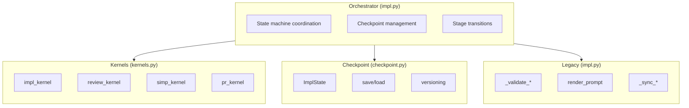
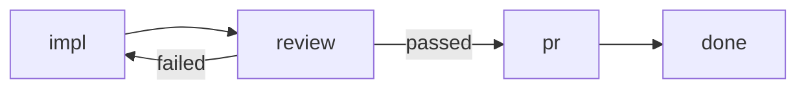

# `python/agentize/workflow/impl/` — `lol impl` Python Implementation

This directory contains the Python implementation of the `lol impl` workflow for
translating GitHub issues into implementation PRs.

## Architecture

The implementation follows a modular kernel-based architecture:



### Module Organization

| File | Purpose |
|------|---------|
| `impl.py` | Main orchestrator with state machine and backward-compatible interface |
| `kernels.py` | Kernel functions for each workflow stage (impl, review, simp, pr) |
| `checkpoint.py` | Serializable state management for workflow resumption |
| `__main__.py` | CLI entrypoint with argument parsing |
| `__init__.py` | Public exports |
| `continue-prompt.md` | Prompt template for implementation iterations |

## Quick Start

### Basic Usage

```python
from agentize.workflow.impl import run_impl_workflow

# Simple implementation
run_impl_workflow(42)

# With options
run_impl_workflow(
    42,
    impl_model="codex:gpt-5.2-codex",
    max_iterations=15,
    yolo=True,
)
```

### Resuming from Checkpoint

```python
from agentize.workflow.impl import run_impl_workflow

# Resume interrupted workflow
run_impl_workflow(42, resume=True)
```

### Using Individual Kernels

```python
from agentize.workflow.impl.checkpoint import create_initial_state
from agentize.workflow.impl.kernels import review_kernel
from agentize.workflow.api import Session

state = create_initial_state(42, Path("/path/to/worktree"))
session = Session(output_dir=state.worktree / ".tmp", prefix="impl-42")

passed, feedback, score = review_kernel(
    state,
    session,
    provider="codex",
    model="gpt-5",
    threshold=75,
)
```

## Workflow Stages

The implementation follows these stages:

1. **Setup**: Resolve worktree, sync branch, prefetch issue
2. **Impl** (`impl_kernel`): Generate implementation using AI
3. **Review** (`review_kernel`): Validate quality (optional, experimental)
4. **Simp** (`simp_kernel`): Simplify/refine (optional)
5. **PR** (`pr_kernel`): Create pull request

### State Machine



## Checkpointing

State is automatically saved after each stage to `.tmp/impl-checkpoint.json`:

```python
from agentize.workflow.impl import ImplState, load_checkpoint

# Load checkpoint
state = load_checkpoint(Path(".tmp/impl-checkpoint.json"))
print(f"Current stage: {state.current_stage}")
print(f"Iteration: {state.iteration}")
```

Checkpoint format includes:
- `version`: Format version for migration
- `timestamp`: When checkpoint was saved
- `state`: Complete `ImplState` with history

## CLI Usage

```bash
# Basic usage
python -m agentize.workflow.impl 42

# With new flags
python -m agentize.workflow.impl 42 \
    --impl-model codex:gpt-5.2-codex \
    --max-iter 15 \
    --enable-review \
    --resume

# Deprecated flags still work
python -m agentize.workflow.impl 42 \
    --backend codex:gpt-5.2-codex \
    --max-iterations 10
```

## Backward Compatibility

The refactored implementation maintains full backward compatibility:

- `_validate_pr_title()` remains at original location for imports
- `--backend` and `--max-iterations` CLI args work with deprecation warnings
- Default behavior unchanged (review stage disabled by default)
- All existing tests pass without modification

## Testing

```bash
# Run all impl-related tests
python -m pytest python/tests/test_impl_*.py -v

# Specific test modules
python -m pytest python/tests/test_impl_checkpoint.py
python -m pytest python/tests/test_impl_kernels.py
python -m pytest python/tests/test_impl_review.py
python -m pytest python/tests/test_impl_pr_title.py
```

## Documentation

- `impl.md` — Main implementation documentation
- `kernels.md` — Kernel function signatures and behaviors
- `checkpoint.md` — State format and checkpoint API
- `__init__.md` — Public interface
- `__main__.md` — CLI documentation

## Extending

### Adding a New Kernel

1. Add function to `kernels.py` following the signature pattern
2. Document in `kernels.md`
3. Add tests in `python/tests/test_impl_kernels.py`
4. Update orchestrator in `impl.py` to call the kernel

### Adding a New Stage

1. Add stage name to `ImplState.current_stage` Literal type
2. Add stage handler in `run_impl_workflow()` state machine
3. Update checkpoint documentation

## Future Work

- Enable review stage by default after further testing
- Extract robust runner with format-fixing retry to `workflow.api`
- Add more sophisticated review criteria configuration
- Support parallel review with multiple models
