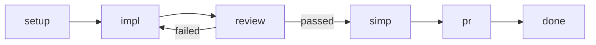
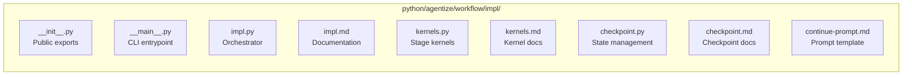

# impl.py

Python workflow implementation for `lol impl`.

## Architecture Overview

The implementation follows a modular kernel-based architecture with:

1. **Orchestrator** (`run_impl_workflow()`): State machine that coordinates stages
2. **Kernels** (`kernels.py`): Pure functions for each workflow stage
3. **Checkpoint** (`checkpoint.py`): Serializable state for resumption

This design separates concerns:
- Orchestrator handles flow control and state transitions
- Kernels encapsulate stage-specific logic and are testable in isolation
- Checkpoint enables recovery from interruptions

## External Interface

### run_impl_workflow()

```python
def run_impl_workflow(
    issue_no: int,
    *,
    backend: str = "codex:gpt-5.2-codex",
    max_iterations: int = 10,
    max_reviews: int = 3,
    yolo: bool = False,
    wait_for_ci: bool = False,
    resume: bool = False,
    impl_model: str | None = None,
    review_model: str | None = None,
) -> None
```

**Purpose**: Execute the issue-to-implementation workflow with review loop
and checkpoint recovery.

**Parameters**:
- `issue_no`: Numeric issue identifier.
- `backend`: Deprecated, use `impl_model` instead.
- `max_iterations`: Maximum implementation iterations before failing.
- `max_reviews`: Maximum review attempts per iteration (prevents infinite loops).
- `yolo`: Pass-through flag for `acw` autonomy.
- `wait_for_ci`: When true, monitor PR mergeability and CI checks after creation.
- `resume`: When true, resume from last checkpoint if available.
- `impl_model`: Model for implementation stage (`provider:model` format).
- `review_model`: Optional different model for review stage.

**Workflow Stages**:

1. **Setup**: Resolve/create worktree, sync branch, prefetch issue
2. **Impl**: Generate implementation using AI
3. **Review**: Validate implementation quality (feedback loop on failure)
4. **Simp**: Optional simplification stage
5. **PR**: Create pull request

**State Machine**:



**Checkpointing**:
- State is saved after each stage completion
- Use `--resume` to continue from last checkpoint
- Checkpoints stored in `.tmp/impl-checkpoint.json`

**Behavior**:
- Resolves the issue worktree via `wt pathto`, spawning with `wt spawn --no-agent` if needed.
- Syncs the issue branch by fetching and rebasing onto the detected default branch.
- Prefetches issue content via `agentize.workflow.api.gh` into `.tmp/issue-<N>.md`.
- Runs implementation iterations through `impl_kernel()`.
- Validates implementation through `review_kernel()` with feedback loop.
- Optionally simplifies through `simp_kernel()`.
- Creates PR through `pr_kernel()` with title validation.
- Optionally monitors CI and re-implements on failures when `wait_for_ci=True`.

**CI Monitoring** (`wait_for_ci=True`):
After PR creation, monitors mergeability and CI checks:
1. Polls PR merge state via `gh pr view` until mergeable
2. If `CONFLICTING`, auto-rebases and force-pushes
3. Waits for CI checks via `gh pr checks --watch`
4. On CI failure, runs additional implementation iteration with failure context
5. Pushes fix and repeats monitoring
6. Stops after `max_iterations` total iterations (including CI fix iterations)

**Errors**:
- Raises `ValueError` for invalid arguments.
- Raises `ImplError` for workflow failures (sync, checkpoint, kernel errors).

## Internal Architecture

### State Management

The orchestrator uses `ImplState` from `checkpoint.py` to track:
- Current stage and iteration
- Last feedback and score
- Execution history

### Kernel Integration

Kernels are called by the orchestrator based on current stage:

```python
if state.current_stage == "impl":
    score, feedback, result = impl_kernel(state, session, ...)
    # Update state, save checkpoint
elif state.current_stage == "review":
    passed, feedback, score = review_kernel(state, session, ...)
    # Update state, retry or continue, save checkpoint
```

### Backward Compatibility

The refactored implementation maintains backward compatibility:
- `_validate_pr_title()` remains at original location for imports
- CLI arguments `--backend` and `--max-iterations` work with deprecation warnings
- Return values and error types unchanged

## Prompt Template

`continue-prompt.md` is a file-based prompt template. The renderer replaces
placeholder tokens and splices optional sections.

The prompt includes explicit instructions for PR title format. The first line
of `finalize_file` is used as the PR title and must follow the format:
`[tag][#issue-number] Brief description`. Available tags are defined in
`docs/git-msg-tags.md`.

**Required placeholders** (both `{{TOKEN}}` and `{#TOKEN#}` forms are accepted):
- `issue_no`
- `issue_file`
- `finalize_file`
- `iteration_section`
- `previous_output_section`
- `previous_commit_report_section`
- `ci_failure_section`

## Outputs

- `.tmp/issue-<N>.md`: Prefetched issue content
- `.tmp/impl-input-base.txt`: Base prompt instructions
- `.tmp/impl-input-<N>.txt`: Iteration-specific prompt
- `.tmp/impl-output.txt`: Latest `acw` output
- `.tmp/finalize.txt`: Completion marker and PR title/body
- `.tmp/impl-checkpoint.json`: Workflow state for resumption

## Internal Helpers

### _validate_pr_title()

Validates PR title format `[tag][#N] description`.

**Location**: Kept in `impl.py` for backward compatibility with imports.

**Raises**: `ImplError` if format is invalid.

### rel_path()

Resolves template files relative to `impl.py` for portability.

### render_prompt()

Builds the iteration prompt by filling placeholders and conditionally inserting
previous output and commit summaries.

### _sync_branch()

Fetches the detected push remote and rebases onto the detected base branch.

### _prefetch_issue()

Fetches issue content via GitHub CLI and caches to file.

## Module Organization



See `kernels.md` for kernel function documentation.
See `checkpoint.md` for state and checkpoint documentation.
